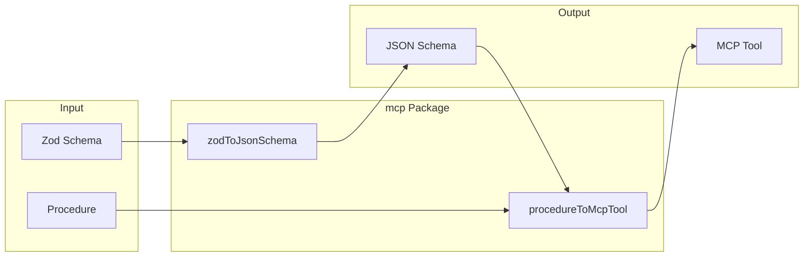
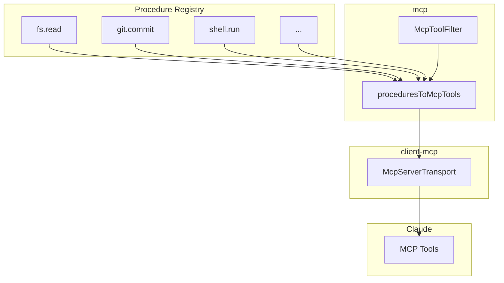
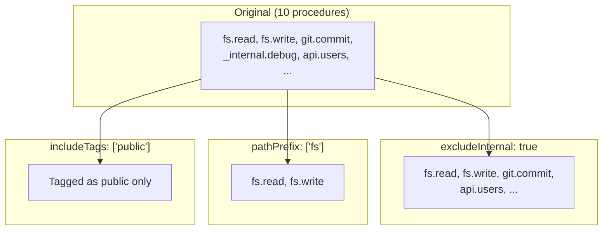

# @mark1russell7/mcp

[](https://opensource.org/licenses/MIT)
[](https://www.typescriptlang.org/)
[](https://nodejs.org/)
[](https://modelcontextprotocol.io/)

> Core types and utilities for MCP (Model Context Protocol) integration. Converts Zod schemas and procedures to MCP-compatible formats.

## Table of Contents

- [Overview](#overview)
- [Installation](#installation)
- [Architecture](#architecture)
- [Quick Start](#quick-start)
- [API Reference](#api-reference)
  - [zodToJsonSchema](#zodtojsonschema)
  - [procedureToMcpTool](#proceduretomcptool)
  - [proceduresToMcpTools](#procedurestomcptools)
- [Tool Filtering](#tool-filtering)
- [Integration](#integration)
- [Requirements](#requirements)
- [License](#license)

---

## Overview

**mcp** provides the foundation for MCP integration:

- **Schema Conversion** - Convert Zod schemas to JSON Schema format
- **Procedure Mapping** - Transform procedures to MCP tool definitions
- **Filtering** - Control which procedures become MCP tools
- **Type Definitions** - TypeScript types for MCP tools and filters

---

## Installation

```bash
npm install @mark1russell7/mcp
```

---

## Architecture

### Conversion Pipeline



### Procedure to MCP Tool Mapping

```mermaid
graph TB
    subgraph "Procedure"
        Path[path: string[]]
        Meta[metadata.description]
        Input[input: ZodSchema]
        Handler[handler: Function]
    end

    subgraph "MCP Tool"
        Name[name: string]
        Desc[description: string]
        Schema[inputSchema: JSONSchema]
    end

    Path -->|"join('.')"| Name
    Meta --> Desc
    Input -->|zodToJsonSchema| Schema
```

### System Integration



---

## Quick Start

```typescript
import { proceduresToMcpTools, zodToJsonSchema } from "@mark1russell7/mcp";
import { PROCEDURE_REGISTRY } from "@mark1russell7/client";

// Convert all registered procedures to MCP tools
const tools = proceduresToMcpTools(PROCEDURE_REGISTRY.getAll());

// Convert a Zod schema to JSON Schema
const jsonSchema = zodToJsonSchema(myZodSchema);
```

---

## API Reference

### zodToJsonSchema

Converts a Zod schema to JSON Schema format for MCP tool input definitions.

```typescript
function zodToJsonSchema(schema: ZodType): JsonSchema;
```

**Supported Zod Types:**

| Zod Type | JSON Schema |
|----------|-------------|
| `z.string()` | `{ type: "string" }` |
| `z.number()` | `{ type: "number" }` |
| `z.boolean()` | `{ type: "boolean" }` |
| `z.array()` | `{ type: "array", items: ... }` |
| `z.object()` | `{ type: "object", properties: ... }` |
| `z.enum()` | `{ type: "string", enum: [...] }` |
| `z.optional()` | Removes from `required` |
| `z.default()` | Adds `default` value |
| `z.describe()` | Adds `description` |

**Example:**
```typescript
import { z } from "zod";
import { zodToJsonSchema } from "@mark1russell7/mcp";

const schema = z.object({
  path: z.string().describe("File path"),
  encoding: z.enum(["utf8", "base64"]).default("utf8"),
});

const jsonSchema = zodToJsonSchema(schema);
// {
//   type: "object",
//   properties: {
//     path: { type: "string", description: "File path" },
//     encoding: { type: "string", enum: ["utf8", "base64"], default: "utf8" }
//   },
//   required: ["path"]
// }
```

---

### procedureToMcpTool

Converts a single procedure to an MCP tool definition.

```typescript
function procedureToMcpTool(procedure: Procedure): McpTool;

interface McpTool {
  name: string;           // Dot-joined path: "fs.read"
  description: string;    // From procedure metadata
  inputSchema: JsonSchema; // Converted from Zod
}
```

**Example:**
```typescript
const tool = procedureToMcpTool(fsReadProcedure);
// {
//   name: "fs.read",
//   description: "Read file contents",
//   inputSchema: { type: "object", properties: { path: ... } }
// }
```

---

### proceduresToMcpTools

Converts multiple procedures to MCP tools with optional filtering.

```typescript
function proceduresToMcpTools(
  procedures: Procedure[],
  filter?: McpToolFilter
): McpTool[];
```

**Example:**
```typescript
// Convert all procedures
const allTools = proceduresToMcpTools(PROCEDURE_REGISTRY.getAll());

// Convert with filtering
const filteredTools = proceduresToMcpTools(procedures, {
  includeTags: ["fs", "git"],
  excludeInternal: true,
});
```

---

## Tool Filtering

Control which procedures are exposed as MCP tools:

```typescript
interface McpToolFilter {
  includeTags?: string[];      // Only include procedures with these tags
  excludeTags?: string[];      // Exclude procedures with these tags
  excludeInternal?: boolean;   // Exclude procedures starting with _
  pathPrefix?: string[];       // Only include procedures with this path prefix
}
```

### Filter Examples



**Usage:**
```typescript
import { proceduresToMcpTools, type McpToolFilter } from "@mark1russell7/mcp";

const filter: McpToolFilter = {
  includeTags: ["fs", "git"],      // Only these namespaces
  excludeTags: ["internal"],       // Exclude internal
  excludeInternal: true,           // Exclude _prefixed
  pathPrefix: ["fs"],              // Only fs.* procedures
};

const tools = proceduresToMcpTools(procedures, filter);
```

---

## Integration

### With client-mcp

```typescript
import { McpServerTransport } from "@mark1russell7/client-mcp";
import { proceduresToMcpTools } from "@mark1russell7/mcp";

// client-mcp uses mcp internally
const transport = new McpServerTransport(server, {
  transport: "stdio",
  // Filter uses McpToolFilter from mcp package
  filter: {
    excludeInternal: true,
  },
});
```

### Package Hierarchy

```mermaid
graph BT
    subgraph "Implementation"
        Impl[impl-mcp-dev]
    end

    subgraph "Transport"
        ClientMCP[client-mcp]
    end

    subgraph "Core"
        MCP[mcp]
        Client[client]
    end

    subgraph "External"
        SDK[@modelcontextprotocol/sdk]
    end

    Impl --> ClientMCP
    ClientMCP --> MCP
    ClientMCP --> Client
    MCP --> Client
    ClientMCP --> SDK
```

---

## Requirements

- **Node.js** >= 20
- **Dependencies:**
  - `@mark1russell7/client`
  - `zod`

---

## License

MIT
